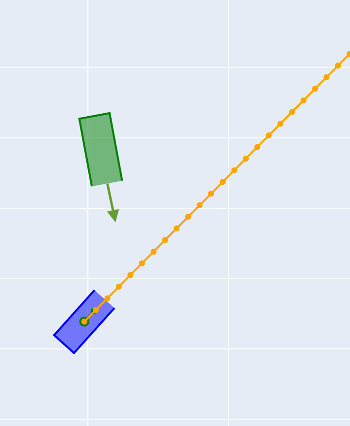
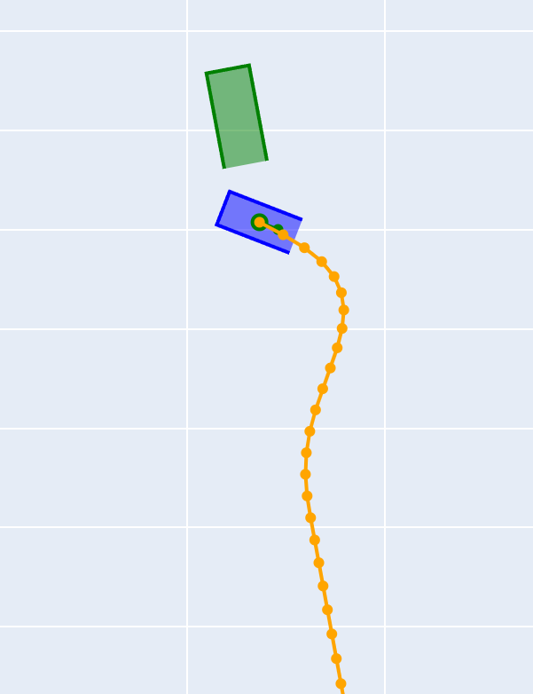
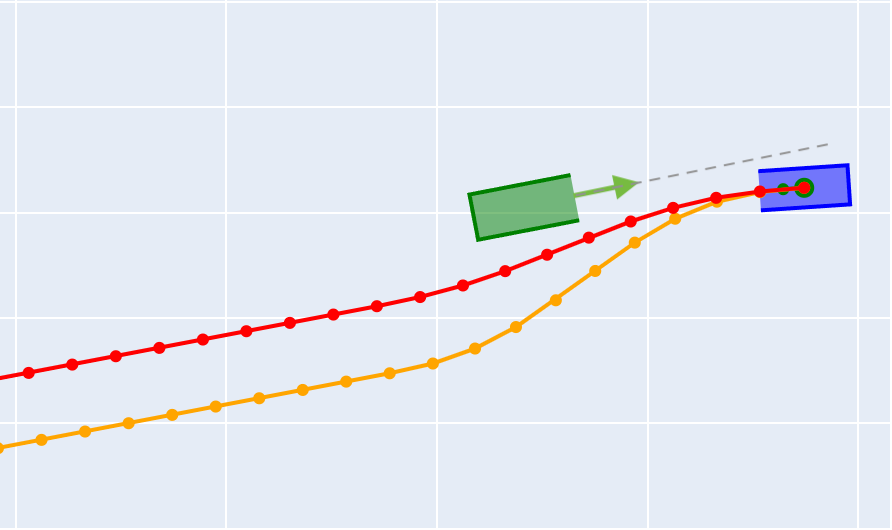

## Safety Reference Benchmarks with Avoidability Criteria for Evaluating Autonomous Driving Systems

### Table of Contents
* [Repository Overview](#repository-overview)
* [Simulation Demonstrations](#simulation-demonstrations)
  * [Autoware](#autoware)
  * [CARLA Agents](#carla-agents)
* [Autoware Collision Analysis](#autoware-collision-analysis)
  * [U-turn scenarios](#u-turn-scenarios)
  * [Swerve scenarios](#swerve-scenarios)
* [Experiment Replication](#experiment-replication)

### Repository Overview
This repository contains the code and data for the paper "Safety Reference Benchmarks with Avoidability Criteria for Evaluating Autonomous Driving Systems."
This repository mainly includes:

1. Safety reference benchmarks to evaluate ADSs for oncoming traffic scenarios. Check folder [safety-benchmarks](safety-benchmarks) for more details. Code to reproduce the benchmarks and animations visualizing the movements of vehicles for each concrete scenario are provided in the folder.

2. Experiment results on [Autoware version 0.41.2](https://github.com/dtanony/Autoware0412) (released February 20, 2025) against our safety reference benchmarks (folder [Autoware-baseline-results](Autoware-baseline-results)).
Trace data, camera videos, and input scripts to simulate all scenarios are provided in the folder.

3. Experiment results on six end-to-end learning-based autonomous driving agents (folder [CARLA-agents-results](CARLA-agents-results)). Replayable log files, JSON trace data, and guide to reproduce the experiments with CARLA are provided in the folder.

4. Experiment results on Autoware when integrating with a controller safety shield (folder [Autoware-shielding-results](Autoware-shielding-results)).

5. Tool for analyzing the recorded traces, e.g., collision status and minimum TTC. Check folder [trace-analysis](trace-analysis) for more details.

\

### Simulation Demonstrations

#### Autoware
<!-- #### U-Turn -->
The following is camera footage of a U-turn collision scenario.

https://github.com/user-attachments/assets/15cfbcc4-beba-46d6-9c1a-2d15d0e9dd6b

<!-- #### Swerve -->
The following is camera footage of a swerve collision scenario.

https://github.com/user-attachments/assets/3325c90d-d321-4931-9670-fa37f9aac2a1

#### CARLA Agents
The following is camera footage of a U-turn collision scenario under control by TransFuser agent.

### Autoware Collision Analysis
Analyzing the traces of Autoware collision runs, we found that perception inaccuracy
could be a primary factor leading to these collisions.
Autoware often struggled to correctly anticipate the future travel paths of oncoming vehicles.

#### U-turn scenarios
For example, consider the following U-turn scenario:
| **Script file** | **Lane** | **Trace file** | **Video** | **Ego Speed** | **NPC Speed** |
|-----------------|----------|----------------|-----------|---------------|---------------|
| [uturn-35-10.script](Autoware-baseline-results/u-turn/scripts/adjacent-lane/uturn-35-10.script) | Adjacent | [uturn_sim9.json](Autoware-baseline-results/u-turn/data/adjacent-lane/run3/uturn_sim9.json) | [uturn_sim9_footage.mp4](Autoware-baseline-results/u-turn/data/adjacent-lane/run3/uturn_sim9_footage.mp4) | 35            | 10            |

A collision occurred in this scenario. **1.7 seconds prior to impact**, 
Autoware still failed to predict a realistic travel path for the oncoming vehicle. 
As shown below, the predicted path lacked a U-turn shape and instead followed a diagonal trajectory crossing multiple lanes, eventually leaving the road.

The green square represents the ego vehicle (with the arrow denoting its direction of travel).
The blue polygon represents the perceived NPC, while the orange line denotes the predicted travel path.
(As can be seen, Autoware also failed to correctly detect the vehicle shape at this moment.)

Only **1 second later**, that is, **0.7 seconds before the collision**, Autoware was finally able to correct the prediction to a U-turn trajectory, as shown in the figure below.

#### Swerve scenarios
A similar issue was observed in swerve scenarios. 
Let's consider the following swerve scenario:
| **Script file** | **Trace file** | **Video** | **Ego Speed** | **NPC Speed** | **Lateral Velocity** |
|-----------------|----------------|-----------|---------------|---------------|----------------------|
| [swerve-30-15-10.script](Autoware-baseline-results/swerve/scripts/vo-15/swerve-30-15-10.script) | [swerve_sim7.json](Autoware-baseline-results/swerve/data/vo-15/run1/swerve_sim7.json) | [swerve_sim7_footage.mp4](Autoware-baseline-results/swerve/data/vo-15/run1/swerve_sim7_footage.mp4) | 30            | 15            | 1.0                  |

In this run, a collision also occurred.
**1 .5 seconds prior to collision**, Autoware still failed to predict a realistic travel path for the oncoming vehicle. The predicted path neither formed a swerve shape nor aligned with any road lanes.

Only **0.8 seconds before the collision**, Autoware corrected the prediction, generating two paths that followed the opposite lanes, as shown below.

### Experiment Replication
To replicate the Autoware experiments, please follow the instructions in the [Autoware-baseline-results](Autoware-baseline-results#experiment-reproduction) folder.

The CARLA recorded log files on the experiments with the six AD agents can be replayed directly in CARLA simulator.
Instruction to do it as well as experiment replication steps are provided in the [CARLA-agents-results](CARLA-agents-results) folder. 