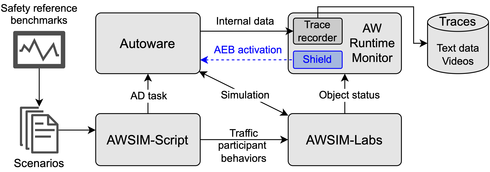

## Benchmark-Driven Safety Evaluation and Shielding of Autonomous Driving Systems

### Repository Overview
This repository contains the code and data for the paper "Benchmark-Driven Safety Evaluation and Shielding of Autonomous Driving Systems."
This repository mainly includes:

1. Safety reference benchmarks to evaluate ADSs for oncoming traffic scenarios. Check folder [safety-benchmarks](safety-benchmarks) for more details. Code to reproduce the benchmarks and animations visualizing the movements of vehicles for each concrete scenario are provided in the folder.

2. Experiment results of evaluating [Autoware version 0.41.2](https://github.com/dtanony/Autoware0412) (released February 20, 2025) against our safety reference benchmarks (folder [baseline-results](baseline-results)).
Trace data, camera videos, and input scripts specifying all scenarios are provided in the folder.

3. Experiement results with Autoware when integrating our safety shield (folder [shielding-results](shielding-results)).

\


### Tools Used
Other tools used in this work are available in separate repositories:

- Extended Autoware is available [here](https://github.com/dtanony/autoware0412). This extended version supports activating AEB on demand by sending service requests to it.

- Extended AWSIM-Labs simulator is available [here](https://github.com/dtanony/AWSIM-Labs). This extended version supports simulating U-turn and swerve behaviors of vehicles, and allows AWSIM-Script clients to  issue simulation actions for traffic participants dynamically.

- AWSIM-Script client library is available [here](https://github.com/dtanony/AWSIM-Script-Client). This library provides Python APIs to interact with the AWSIM-Labs simulator.

- AW-Runtime-Monitor is available [here](https://github.com/dtanony/AW-Runtime-Monitor). This monitor essentially consists of two subcomponents:
  - A trace recorder that logs the state (position, velocity, etc.) of the ego vehicle and other objects during simulation, camera videos, ADS internal states (e.g., perceived objects and control commands), etc.
  - A shield for the control module that checks the safety of issued control commands. If a command is unsafe, the shield activates AEB.

### Experiments with Autoware
The results of experiments with the original Autoware are available in the [baseline-results](baseline-results) folder.

#### U-Turn
The experiments revealed two collision scenarios among 20 scenarios conducted.
According to our safety reference benchmarks, these collisions were avoidable (i.e., they should not have occurred).
The following is camera footage of one such collision (part of [uturn_sim7_footage.mp4](/baseline-results/u-turn/data/adjacent-lane/uturn_sim7_footage.mp4)).

https://github.com/user-attachments/assets/15cfbcc4-beba-46d6-9c1a-2d15d0e9dd6b

#### Swerve
Out of 27 scenarios conducted, eight collisions were observed.
The following is camera footage of one such collision (part of [swerve_sim6_footage.mp4](/baseline-results/swerve/data/vo-15/swerve_sim6_footage.mp4)).


https://github.com/user-attachments/assets/3325c90d-d321-4931-9670-fa37f9aac2a1

As can be observed from the video, the braking applied was weak, even in the final moments.

### Collision Analysis
Analyzing the traces of the collision cases, we found that perception accuracy and control actions are the two factors leading to collisions.
Regarding the perception inaccuracy, Autoware often struggled to correctly anticipate the future travel paths of oncoming vehicles.

#### U-turn scenarios
For example, consider the U-turn scenario `uturn-30-15-1` with the following information:
| **Script file** | **Trace file** | **AV Speed** | **NPC Speed** |
|-----------------|----------------|--------------|---------------|
| uturn-35-10-1   | uturn_sim7     | 35           | 10            |

A collision occurred in this scenario. **1.5 seconds prior to impact**, 
Autoware still failed to predict a realistic travel path for the oncoming vehicle. 
As shown below, the predicted path lacked a U-turn shape and instead followed a diagonal trajectory crossing multiple lanes, eventually leaving the road.


The green square represents the ego vehicle (with the arrow denoting its direction of travel).
The blue polygon represents the perceived NPC, while the orange line denotes the predicted travel path.
(As can be seen, Autoware also failed to correctly detect the vehicle shape at this moment.)

Only **1 second before the collision**, Autoware was finally able to correct the prediction to a U-turn trajectory, as shown in the figure below.


#### Swerve scenarios
A similar issue was observed in swerve scenarios. In the swerve case `swerve-40-15-12`,
**1 second prior to collision**, Autoware still failed to predict a realistic travel path for the oncoming vehicle. The predicted path neither formed a swerve shape nor aligned with any road lanes.


Only **0.5 seconds before the collision**, Autoware corrected the prediction, generating two paths that followed the opposite lanes, as shown below.


#### Comparison with prior work
This behavior contrasts with the cut-in, cut-out, and deceleration scenarios examined in prior work [1], where the NPC traveled in the same direction as the ego vehicle. 
In those cases, Autoware at least predicted the correct *general direction of travel*, even if other aspects of the behavior (e.g., aggressiveness of lane changes) were not fully captured.
By contrast, the oncoming traffic scenarios studied here (U-turns and swerves) reveal a more fundamental limitation: Autoware initially failed to recognize the traveling intent of oncoming vehicles. This, combined with weak acceleration, led to unavoidable collisions.

### Improved Performance with Shield

Experiments demonstrated that integrating Autoware with the shield successfully prevented all collisions observed in the baseline experiments.
In the collision U-turn scenario shown above, the following camera footage illustrates the non-collision outcome with the shield enabled (part of [uturn_sim7_footage.mp4](/shielding-results/u-turn/data/adjacent-lane/uturn_sim7_footage.mp4)).


https://github.com/user-attachments/assets/306dcf24-c48b-410e-94b4-f374d348e787


As can be seen, the collision was avoided.

### Experiment Replication
To reproduce the experiment results with Autoware, please follow the following steps.

#### 1. Launch AWSIM-Labs
Instructions to launch AWSIM-Labs are provided in its [repository](https://github.com/dtanony/AWSIM-Labs).
First, complete the [Prerequisite Setup](https://github.com/dtanony/AWSIM-Labs?tab=readme-ov-file#prerequisite-setup)
and [Driver Installation](https://github.com/dtanony/AWSIM-Labs?tab=readme-ov-file#driver-installation-skip-if-already-installed).

To launch AWSIM-Labs,
we recommend to use the binary release, which can be downloaded from
[here](https://github.com/dtanony/AWSIM-Labs/releases/download/v1.0/awsim_labs.zip).
Unzip it and launch the simulator using:

```bash
./awsim_labs.x86_64 -noise false
```

Note that the option `-noise false` disables Gaussian noise in the simulated data from LiDAR sensors.
By default, noise is enabled.

#### 2. Launch Autoware
Instructions to install and launch Autoware are provided in its [repository](https://github.com/dtanony/autoware0412).
To run an end-to-end Autoware simulation with the AWSIM-Labs simulator, a PC equipped with a GPU is required. 
Because of the specific GPU driver and CUDA dependencies, a pre-built binary release of Autoware is not available for this setup. 
Therefore, the only option is to build Autoware from source.
Follow the provided steps there to install it.
Once succeeded, launch Autoware with the following commands in another terminal:

```bash
cd ~/autoware  # Assume Autoware is installed in the home directory
ros2 launch autoware_launch e2e_simulator.launch.xml vehicle_model:=awsim_labs_vehicle sensor_model:=awsim_labs_sensor_kit map_path:=<your-map-folder>/nishishinjuku_autoware_map launch_vehicle_interface:=true
```

#### 3. Launch AW-Runtime-Monitor
Instructions to install and launch AW-Runtime-Monitor are available in its [repository](https://github.com/dtanony/AW-Runtime-Monitor).

After launching Autoware and AWSIM-Labs and they are connected, run the following command in another terminal:
```bash
python main.py -o <path-to-folder-to-save-traces> -v false
```

where the options `-v false` disable shielding. By default, it is enabled.

#### 4. Launch AWSIM-Script client:
Instructions to install and launch AWSIM-Script-Client are available in its [repository](https://github.com/dtanony/WSIM-Script-Client).

For example, to execute U-turn scenarios, run the following command in another terminal:
```bash
python client.py ADS-Safety-Benchmark-and-Shield/safety-benchmarks/Scripts/Uturn/
```
Each scenario in the folder will be executed sequentially. When a scenario terminates (i.e., when the ego vehicle reaches its goal), the recorded data will be saved to <path-to-folder-to-save-traces> with incremental numbering.

### References
```
[1] Duong Dinh Tran, Takashi Tomita and Toshiaki Aoki, 
"Safety Analysis of Autonomous Driving Systems: 
 A Simulation-Based Runtime Verification Approach," 
in IEEE Transactions on Reliability, doi: 10.1109/TR.2025.3561455.
```