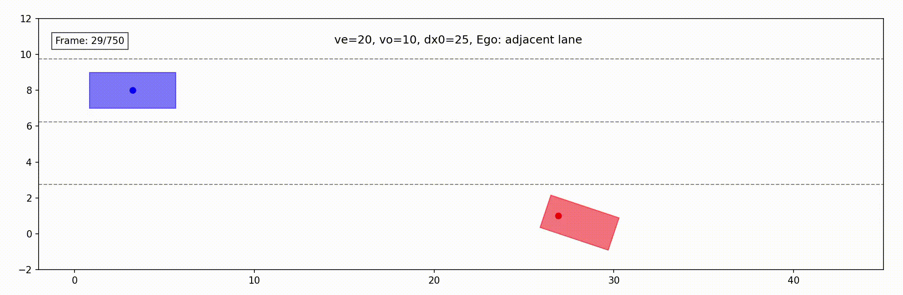

## Safety Reference Benchmarks for Swerve and U-Turn Oncoming Traffic Scenarios

The benchmarks can be viewed in the `png` files inside the [swerve](swerve) and [uturn](uturn) folders.

### Benchmark Replication
Python source code to reproduce the safety benchmarks is provided.
For example, to reproduce the benchmarks for a U-turn scenario where the ego vehicle travels in the rightmost lane (under left-hand traffic) and the oncoming vehicle (NPC) speed is 10 km/h, run:

```bash
python -m uturn.uturn -vo 10
```

For more detailed usage, use the `-h` option:
```bash
python -m uturn.uturn -h
python -m swerve.uturn -h
```

### Motion Visualization
We also provide code to animate the motions of the two vehicles in a specific scenario.
This allows users to validate/debug both the simulation and the benchmark results.

For example, the following command produces an animation for a scenario where the ego speed is 20 km/h, the NPC speed is 10 km/h, the ego travels in the lane adjacent to the rightmost lane, and the initial longitudinal distance between them is 25 m:


```bash
python -m uturn.visualization -vo 10 -ve 20 -dx0 25 --lane adjacent
```

This will produce an animation like the following image:



For more detailed usage, use the `-h` option:
```bash
python -m uturn.visualization -h
python -m swerve.visualization -h
```